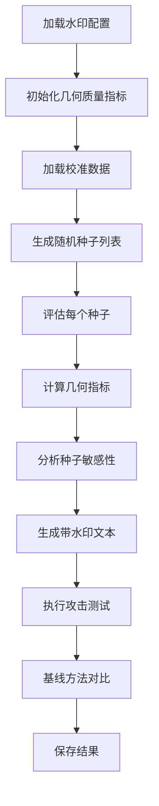

# MoE LSH 水印种子敏感性实验代码结构

## 概述

本文档说明基于论文《混合专家模型与语义哈希水印中的随机种子敏感性》构建的完整实验代码结构。

## 代码架构

```
moe-lsh-1.0/
├── moe_lsh/                          # 核心水印实现
│   ├── MoELSHWatermark.py            # SemHash 水印主实现
│   └── models/                        # MoE 模型支持
│
├── experiments/                       # 实验代码（新建）
│   ├── __init__.py
│   ├── geometric_metrics.py          # 几何质量指标
│   ├── seed_evaluator.py              # 种子敏感性评估
│   ├── attack_methods.py             # 攻击方法实现
│   ├── baseline_comparison.py         # 基线方法对比
│   ├── main_experiment.py             # 主实验脚本
│   └── README.md                      # 实验说明文档
│
└── docs/                              # 论文文档
    └── moe_lsh_seed_sensitivity_icml2025.pdf
```

## 核心模块分析

### 1. 现有 SemHash 实现 (moe_lsh/MoELSHWatermark.py)

**关键组件：**

- **MoE_RW_Extractor**: 从 MoE 模型中提取路由权重向量
  - `extract_from_embs()`: 从路由权重张量中提取向量
  - `get_rw_vector()`: 获取单个 token 的路由权重向量

- **LSH_Semantic_Encoder**: LSH 签名生成和绿色词表选择
  - `get_signature()`: 生成 LSH 二进制签名
  - `get_green_list()`: 根据路由权重生成绿色词表
  - 使用随机投影矩阵 `random_vectors` 进行 SimHash

- **WatermarkGeneratorContext**: 生成时的上下文管理器
  - 通过猴子补丁临时替换 `model.forward()`
  - 在生成过程中应用水印偏置

**关键特性：**
- 支持多 MoE 层融合（start_layer 到 end_layer）
- 使用 top-k 路由权重
- 基于语义池的绿色词表选择

### 2. 几何质量指标 (experiments/geometric_metrics.py)

**三类指标：**

1. **语义簇分割熵** (`compute_split_entropy`)
   - 使用 k-means 对词表进行语义聚类
   - 计算每个簇的绿色词表比例
   - 得分公式：`Score = 1 - (1/K) * Σ(2|r_i - 0.5|)²`
   - 范围 [0, 1]，越高越好

2. **Wasserstein 距离** (`compute_wasserstein_distance`)
   - 计算原始 Logits 分布与水印后分布的 W1 距离
   - 使用语义嵌入距离矩阵
   - 越小越好，表示概率质量只在近邻 Token 间移动

3. **投影方差与 PCA 对齐度** (`compute_projection_variance`, `compute_pca_alignment`)
   - 投影方差：衡量投影向量是否捕捉到数据主要变化
   - PCA 对齐度：计算投影向量与主成分的余弦相似度平方和
   - 越大越好，表示投影方向与数据流形对齐

### 3. 种子敏感性评估 (experiments/seed_evaluator.py)

**功能：**

- `evaluate_single_seed()`: 评估单个种子的性能
  - 检测分数（z-score）
  - 几何质量指标
  - 绿色词表统计

- `evaluate_multiple_seeds()`: 批量评估多个种子
  - 支持并行评估
  - 保存详细结果到 JSON

- `analyze_seed_sensitivity()`: 分析种子敏感性
  - 统计检测分数和分割熵的分布
  - 识别高质量和低质量种子
  - 计算百分位数阈值

### 4. 攻击方法 (experiments/attack_methods.py)

**实现的攻击：**

- **BigramParaphraseAttack**: 基于 bigram 替换的改写
- **LLMParaphraseAttack**: 使用 GPT-4 等 LLM 进行改写（需要 API 密钥）
- **B4ScrubbingAttack**: B4 黑盒清洗方法
- **MixedAttack**: 混合多种攻击方法

**AttackEvaluator**: 评估水印对攻击的鲁棒性
- 计算攻击后的检测率和平均分数

### 5. 基线对比 (experiments/baseline_comparison.py)

**基线方法：**

- **KirchenbauerWatermark**: 实现经典的绿色词表水印
  - 基于前一个 token 的伪随机函数生成绿色词表
  - 对绿表 Token 应用 logit 偏置

**BaselineComparator**: 对比我们的方法与基线
- 生成质量对比
- 检测鲁棒性对比

### 6. 主实验脚本 (experiments/main_experiment.py)

**三个主要实验：**

1. **种子敏感性实验** (`run_seed_sensitivity_experiment`)
   - 评估多个随机种子的性能
   - 计算几何质量指标
   - 分析种子敏感性统计

2. **攻击鲁棒性实验** (`run_attack_robustness_experiment`)
   - 对带水印文本执行各种攻击
   - 评估攻击后的检测率

3. **基线对比实验** (`run_baseline_comparison_experiment`)
   - 与 Kirchenbauer 等方法对比
   - 评估生成质量和检测鲁棒性

## 实验流程



## 使用示例

### 基本使用

```python
from moe_lsh.MoELSHWatermark import MoELSHWatermark
from experiments.seed_evaluator import SeedEvaluator
from experiments.geometric_metrics import GeometricQualityMetrics

# 1. 加载水印
watermark = MoELSHWatermark(algorithm_config="config.json")

# 2. 初始化几何指标
embedding_matrix = watermark.config.generation_model.get_input_embeddings().weight
geometric_metrics = GeometricQualityMetrics(
    embedding_matrix=embedding_matrix,
    vocab_size=watermark.encoder.vocab_size
)

# 3. 评估种子
seed_evaluator = SeedEvaluator(
    watermark=watermark,
    geometric_metrics=geometric_metrics,
    calibration_texts=["text1", "text2", ...]
)

results = seed_evaluator.evaluate_multiple_seeds(
    seeds=["seed_1", "seed_2", ...],
    test_prompts=["prompt1", "prompt2", ...]
)
```

### 命令行使用

```bash
# 运行完整实验
python experiments/main_experiment.py \
    --config configs/watermark_config.json \
    --num_seeds 50 \
    --output_dir results \
    --experiment all

# 只运行种子敏感性实验
python experiments/main_experiment.py \
    --config configs/watermark_config.json \
    --experiment seed
```

## 输出结果格式

### seed_sensitivity_analysis.json

```json
{
  "num_seeds": 50,
  "detection_score_stats": {
    "mean": 5.23,
    "std": 2.15,
    "min": 0.45,
    "max": 8.92,
    "median": 5.10
  },
  "split_entropy_stats": {
    "mean": 0.65,
    "std": 0.12,
    "min": 0.23,
    "max": 0.89
  },
  "high_quality_seeds": [
    {
      "seed": "seed_42_15",
      "detection_score": 8.92,
      "split_entropy": 0.89
    }
  ],
  "low_quality_seeds": [...]
}
```

### attack_robustness_results.json

```json
{
  "BigramParaphraseAttack": {
    "avg_detection_score": 4.56,
    "detection_rate": 0.72,
    "num_texts": 10
  },
  "MixedAttack": {
    "avg_detection_score": 3.21,
    "detection_rate": 0.45,
    "num_texts": 10
  }
}
```

## 关键设计决策

1. **模块化设计**: 每个功能独立成模块，便于扩展和维护

2. **可配置性**: 通过配置文件控制实验参数

3. **结果可复现**: 使用固定随机种子，结果可保存为 JSON

4. **扩展性**: 易于添加新的几何指标、攻击方法或基线方法

5. **性能考虑**: 支持 GPU 加速，批量处理优化

## 未来扩展方向

1. **白化变换实现**: 在 LSH 之前对嵌入进行白化
2. **PCA-LSH**: 使用 PCA 主成分作为投影向量
3. **k-SemStamp**: 基于聚类的非线性划分
4. **更多基线方法**: SemStamp, Unigram Watermark 等
5. **可视化工具**: 绘制种子敏感性分布图、几何指标热力图等

## 参考文献

论文中提到的关键方法：
- Kirchenbauer et al. (2023): 绿色词表水印
- SemStamp (Zhao et al., 2024): 句子级语义水印
- B4 (Liu et al., 2025): 黑盒水印清洗

